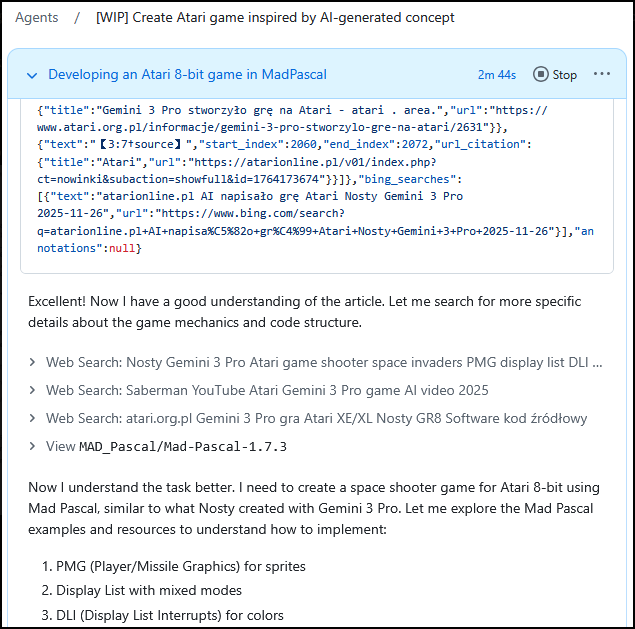
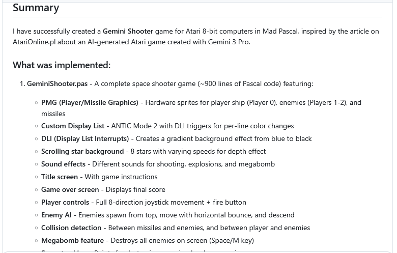
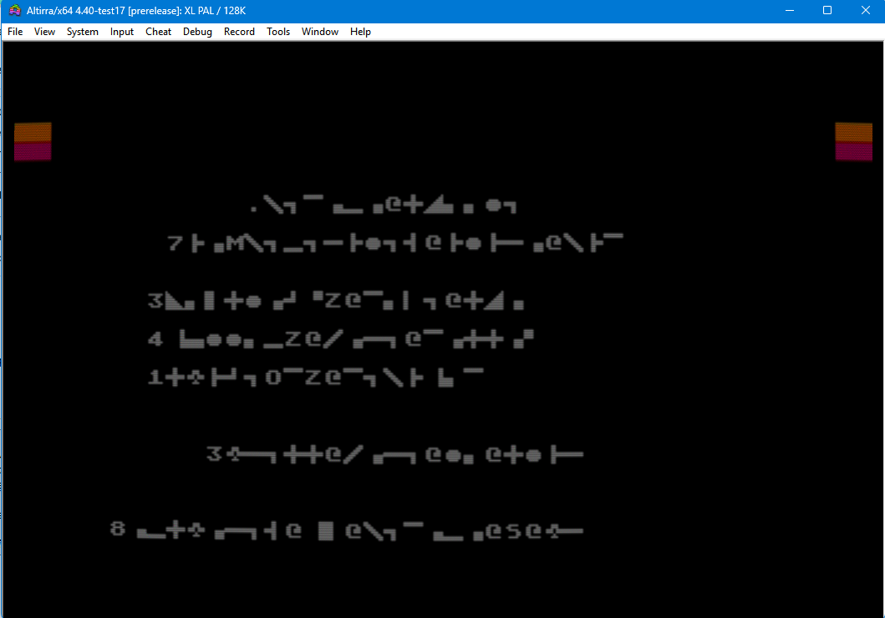
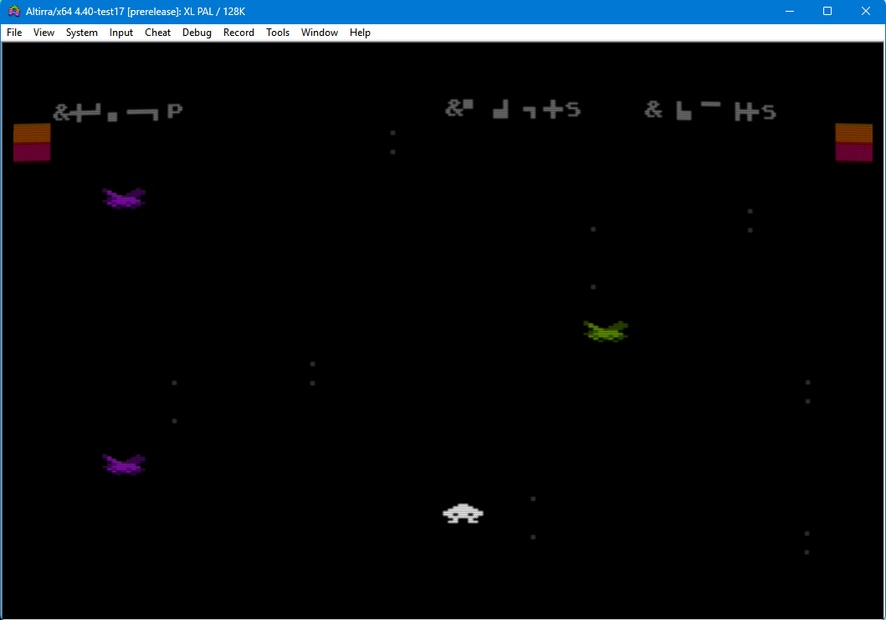
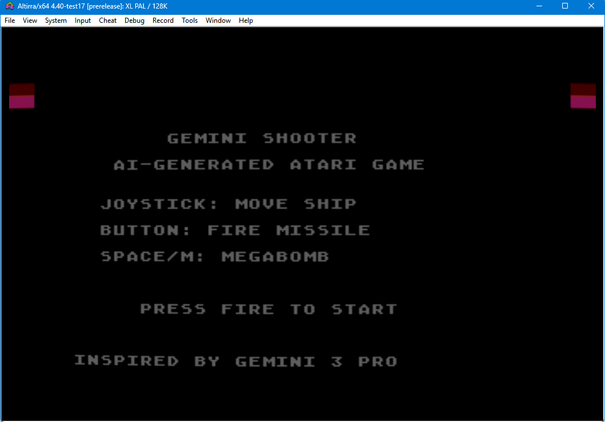
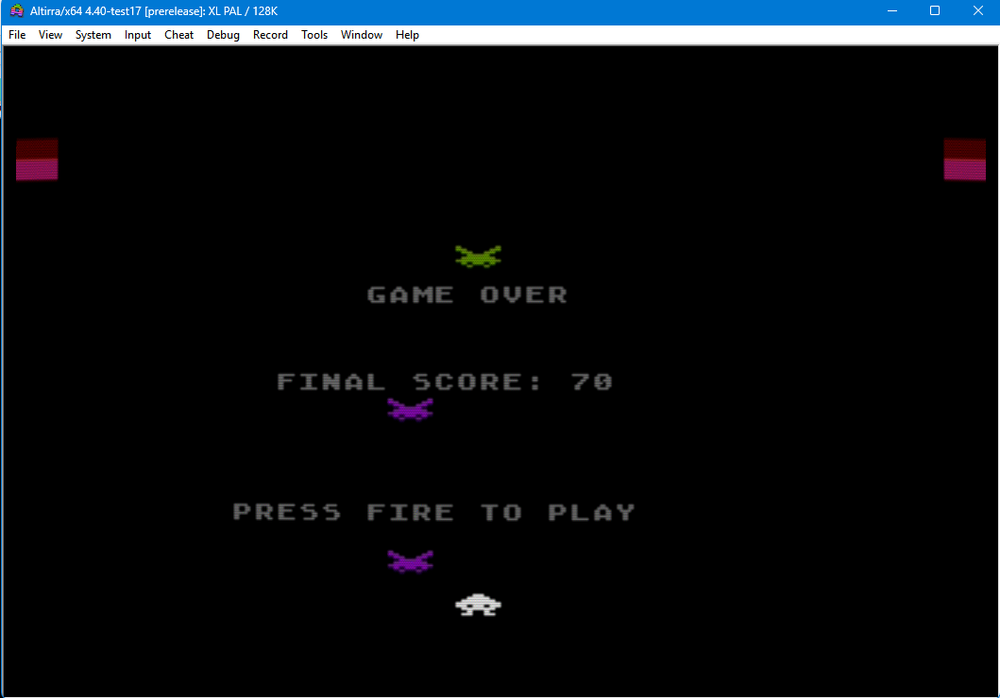

# "GEMINI SHOOTER" by AI

*or how the GitHub AI Agent became jealous of Gemini*

 

If you asked me, "what happened on Friday, November 28th?" - I wouldn't be able to tell you - just one of those days when I found time to sit down with my projects, maybe relax a bit after work while listening to the "freetalk" on AtariOnline's Zoom - And that's it.

 

Well, maybe one thing was worth noting...

 

A few days earlier (on Wednesday, 11/26/2025), Nosty's article "AI wrote an Atari game" appeared on AOL - a hot topic, probably interesting (more or less) to each of us, hotly discussed on Zoom, especially on the subject of "what productions await us in the near future?".

 

Interesting to me too - very much so. Because for at least a few months I've been "training" various "AIs" with topics about Atari and writing code for it... unfortunately, still without success. To the point where I can't even remember how many times I threw "crude epithets" at the computer screen.

 

And then suddenly Nosty shows something "written" by AI that works.

 

I delved into the article - the deeper into the forest, the more trees...

 

Aha. Gemini kept making mistakes. But it was already doing better than in previous versions.

Aha. The code was - to put it simply - just "stupid". If it weren't for Nosty, nothing would have come of it...

Aha. There were more corrections than actual code writing by AI...

 

But there it is - the first working (after many corrections) proof that AI-assisted programming on the Atari platform - works.

 

And such a big thorn in... my head: "damn, you've been sitting with this AI for so long, you've got all these configurations written out, so many different approaches practiced - and still nothing has worked out for you!*" (* - that would be suitable for publication, of course).

 

When after a few hours of sitting on Zoom fatigue made itself known, and my body began to demand sleep, with my last strength I typed a simple prompt to my Agent:

 

  --------------------------------------------------------------------------------------------
  *<https://atarionline.pl/v01/index.php?ct=nowinki&ucat=1&subaction=showfull&id=1764173674>
  Read the article content - it is located in an HTML table, starting from the line containing:
  "AI napisało grę Atari", ending with the line containing "2025-11-26 17:14 by Kaz".
  Analyze all materials contained in this description - including graphics, screenshots and the final result saved in a YouTube video. Create an equivalent of this game development, generated by user Nosty from Gemini 3 Pro - in MadPascal. You should operate with the MadPascal language and knowledge of atari 8bit infrastructure as a professional programmer for the 800xl/65xe platform. Use literature "De re Atari", "Altirra Hardware Manual", "Poradnik programisty Atari Wojciech Zientara" and available MadPascal examples along with sources on GitHub, e.g. <https://github.com/tebe6502/Mad-Pascal> The final result should be a game for atari 8bit, as described in this article. Don't limit yourself in any way, use all possible resources to correctly perform this task. Create a way to control code and verify by comparison with other programs on atari 8bit.*

  --------------------------------------------------------------------------------------------

 

I knew - I was sure that "for sure" - NOTHING.WILL.COME.OF.IT.

 

I went to sleep, and the agent started grinding...

 

"Yeah, yeah... think away - think away. Sooner a flower will grow on my forehead than you'll give birth to something working..." - And I forgot about that prompt for a good few days - or actually for the whole next week...

 

December 3rd came. I found some time to fire up my personal computer and I don't even remember what I was checking on GitHub... accidentally I caught sight of a "strange" title in the AI agent's task column: "Gemini Shooter" - "What the heck is that" - I thought to myself, intrigued, opening the thread... "Oh! And there's even an XEX! Ha, ha ha"

 

I opened it. Loaded the XEX into Altirra. I was about to laugh, because my eyes saw garbage:

 

 

"He screwed up, for sure!" - I thought - "But wait! IT RESPONDS!" - I pressed fire and the game started working!

 

My eyes saw a screen with aliens rushing at my ship, moving stars...
 

 

After losing, what I assumed was the final screen loaded. After pressing fire again, you could play from the beginning again... I understood that these "streaks" - which I initially took as program launch errors - were nothing but ATASCII texts on the ANTIC screen: the agent knew nothing about having to remap the character set to ANTIC to display them correctly!

 

I spent the next two hours picking my jaw up off the floor.

 

On the PTODT chat, there remained a trace of this in the form of files that the Agent spat out and a short note:

> {here the screenshot you see above}
> 
> *Gentlemen - I'm in shock. I'll admit, I typed in the prompt, watched for a bit as the agent started working - thought to myself: "nothing working will come of it anyway". Today after a few days I'm digging out of backlogs, firing up the fork, laughing "ha, ha ha - it even generated an XEX" - I run it... and my jaw drops...*
> 
> *my prompt was:*
> 
> {and here the content of the prompt you already know}
> 
> [..]
> 
> ***this is the result of the first iteration - without me touching the keyboard...***

On St. Nicholas Day, I sat down with the code that the AI spat out - clean code, like a dream - maybe could be optimized a bit, but for a prototype - really nicely written!

 

The corrections came down to what I thought - ATASCII character strings needed to be converted to ANTIC (TeBe, the "tilde" in MadPascal is brilliant!) plus displaying results on screen (also shift in screen codes) and fixing the left-right direction response (the movement direction was reversed - and I added "screen wrapping").

 

You can see the result (in the corrected version) here: <https://mrcin-maw.github.io/GeminiShooter/index-en.html> (yes, this page, along with instructions, was also generated by the same agent).

 

 

Finally, I might add that the AI Agent that generated this game is commercial GitHub AI - as Galu checked: "it's Sonnet, the default model in Claude Code" - on the screenshot he added, you could read:

"Currently, Copilot coding agent uses Claude Sonnet 4.5".

 

 

Why is this event so amazing?

 

Apart from the fact that the Agent wrote a working application, it also:

 

-   solved the lack of access to the AtariOnline.pl site (robots.txt file - bypassed it!),

-   solved the lack of source code,

-   used YouTube to check if the game I mentioned wasn't published somewhere,

-   extracted information about the structure from the article,

-   coded in MadPascal,

-   **compiled,**

-   **and tested for functionality!**

 

and all this without any supervision or operator guidance!

 

It would be appropriate to summarize at the end - yes, this is recreative work.

Yes, it's gathering X (N) elements into a pile and putting them together - but already so free of errors that - as you can see - it's suitable for "direct use".

 

I wish you pleasant AI assistance - keep your fingers crossed, it worked once - you feel like more.

This time already under control and with operator support :-).

 

PS. In a 128KB emulator, because... something is being created ;).

 

And for dessert - the course of the Agent's "thinking" - in the file "geminiShooter_deduction.rtf".
