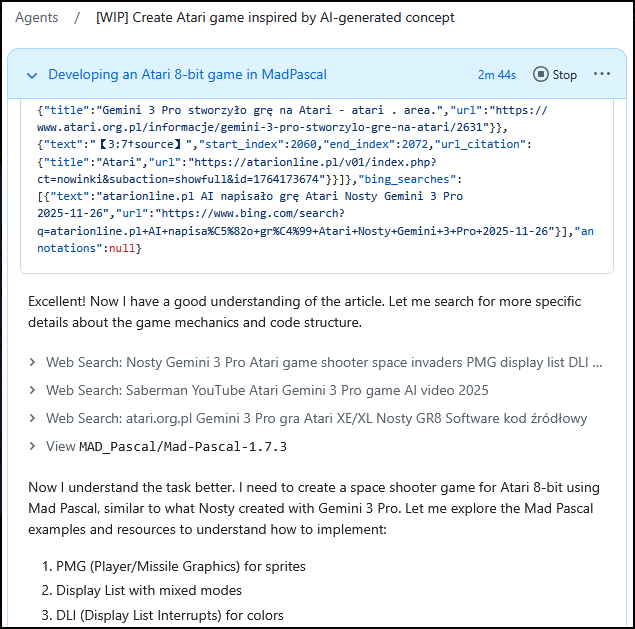
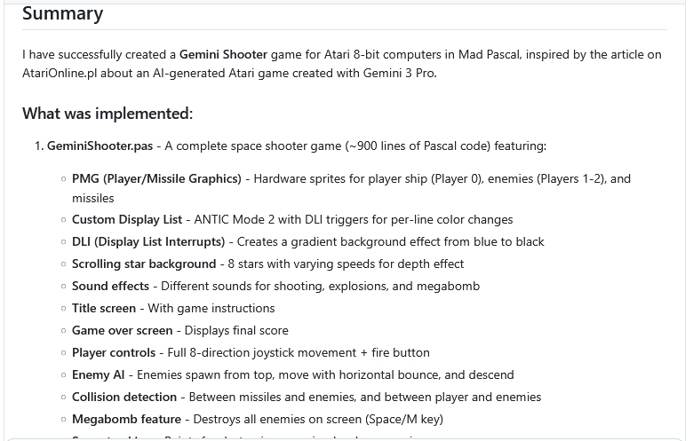
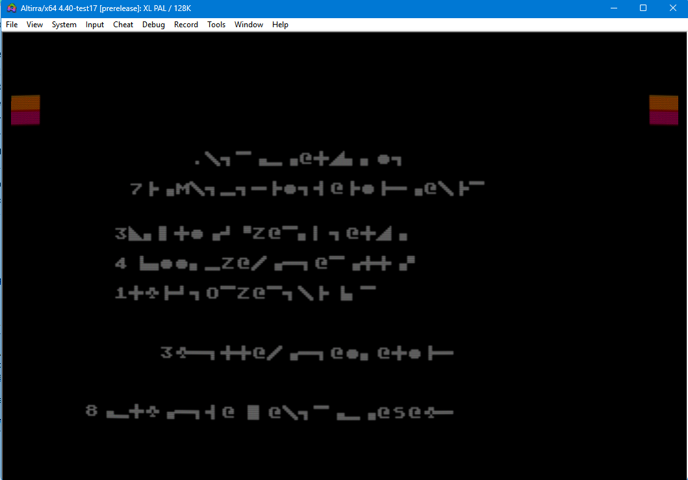
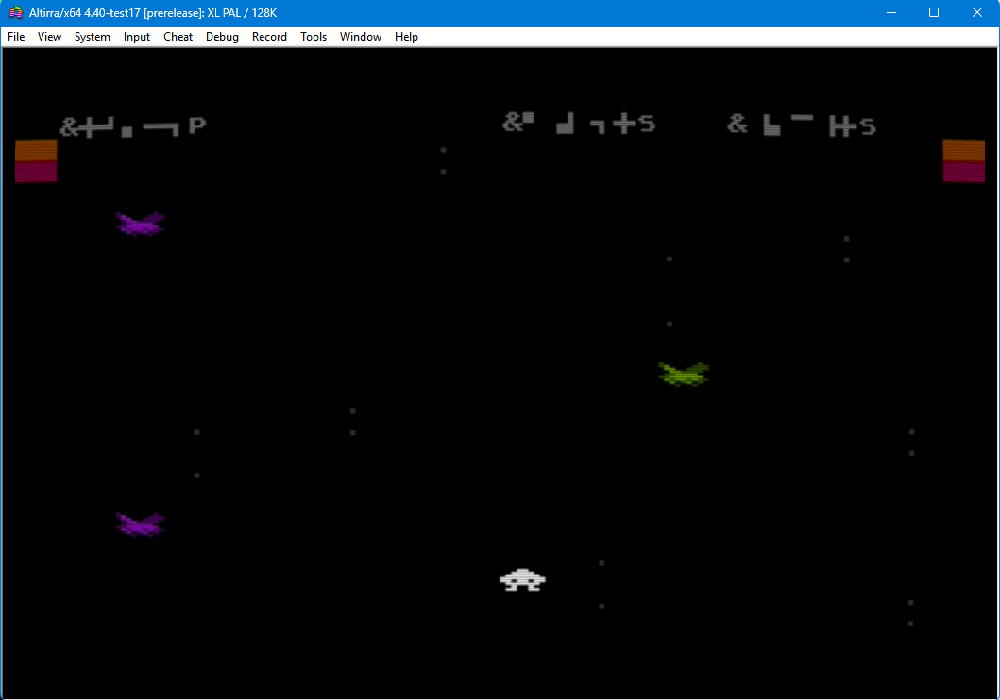
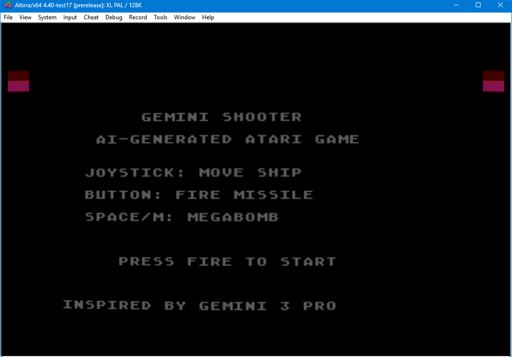
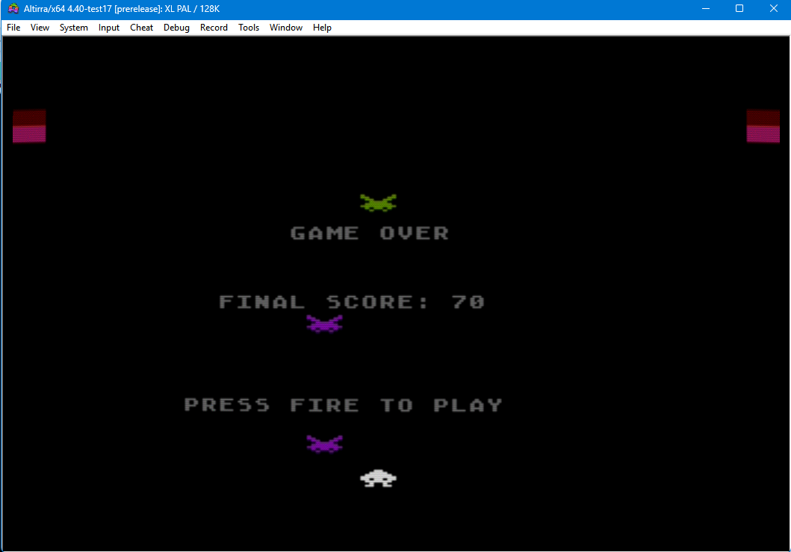

# "GEMINI SHOOTER" by AI

*czyli jak GitHubowy Agent AI pozazdrościł koledze(koleżance?) Gemini*

 

Gdybyś mnie zapytał, \"co się działo w piątek 28.go listopada?\" - nie
byłbym w stanie Ci powiedzieć - ot, jeden z tych dni, kiedy znalazłem
czas siąść do swoich projektów, może trochę odpocząć po pracy słuchając
\"freetalku\" na Zoomie AtariOnline - I tyle.

 

No, może jedna rzecz była warta uwagi...

 

Parę dni wcześniej (w środę, 26.11.2025) na AOL pojawił się artykuł
Nosty\'ego \"AI napisało grę Atari\" - gorący temat, chyba interesujący
(mniej lub bardziej) każdego z nas, dyskutowany ostro na Zoomie,
zwłaszcza w temacie \"jakie produkcje czekają nas w najbliższym
czasie?\".

 

Interesujący też mnie - i to bardzo. Bo conajmniej od kilku miesięcy
\"(s)tresuję\" różne \"jejAje\" wątkami na temat Atari i pisaniem na nie
kodu... niestety, ciągle bez powodzenia. Do tego stopnia, że już nie
pamiętam, ile razy rzucałem do ekranu komputera \"niewybrednymi
epitetami\".

 

A tu nagle Nosty pokazuje coś \"napisanego\" przez AI, co działa.

 

Zagłębiłem się w artykuł - im głębiej w las, tym więcej drzew...

 

Acha. Gemini non stop się mylił. No ale szło mu już lepiej niż w
poprzednich wersjach.

Acha. Kod był - mówiąc prostym językiem - po prostu \"głupi\". Jakby nie
Nosty, to nic by z tego nie wyszło...

Acha. Poprawek tam było więcej niż samego pisania kodu przez AI...

 

No ale jest - pierwszy działający (po wielu poprawkach) efekt tego, że
programowanie wspomagane przez AI na płaszczyźnie Atari - działa.

 

No I taka duża szpila w... głowie: \"qrde, tyle siedzisz z tym AI, takie
masz już te konfiguracje wypisane, tak przećwiczone różne podejścia - a
jeszcze Ci nic nie wyszło!\*\" (\* - co nadawało by się do opublikowania
oczywiście).

 

Kiedy po kilku godzinach siedzenia na Zoomie zmęczenie dało znać o
sobie, a organizm zaczął domagać się snu, ostatkiem sił wklepałem do
swojego Agenta prostego prompta:

 

  --------------------------------------------------------------------------------------------
  *<https://atarionline.pl/v01/index.php?ct=nowinki&ucat=1&subaction=showfull&id=1764173674>
  Przeczytaj treść artykułu - znajduje się on się w tabeli html, od wiersza zawierającego:
  \"AI napisało grę Atari\", kończy na wierszu zawierającym \"2025-11-26 17:14 by Kaz\".
  Przeanalizuj wszystkie materiały zawarte w tym opisie - włacznie z grafikami, zrzutami
  ekranu i końcowym efektem zapisanym w filmie na YouTube. Stwórz odpowiednik tego opracowania
  gry, wygenerowanego przez użytkownika Nosty z Gemini 3 Pro - w MadPascalu. Masz operować
  językiem MadPascal i znajomością infrastruktury atari 8bit jak profesjonalny programista na
  plstformę 800xl/65xe. Posiłkuj się literaturą \"De re Atari\", \"Altirra Hardware Manual\",
  \" Poradnik programisty Atari Wojciech Zientara\" oraz dostępnych przykładów MadPascal wraz
  ze źródłami na GitHubie, np. <https://github.com/tebe6502/Mad-Pascal> Końcowym efektem ma
  być gra na atari 8bit, jak opisana w tym artykule. Nie ograniczaj się niczym, użyj wszelkich
  możliwych zasobów, aby poprawnie wykonać te zadanie. Stwórz sposób kontroli kodu i
  weryfikacji poprzez porównanie z innych programów na atari 8bit.*

  --------------------------------------------------------------------------------------------

 

Wiedziałem - byłem pewny, że \"na pewno\" - NIC.Z.TEGO.NIE.WYJDZIE.

 

Ja poszedłem spać, a agent zaczął mielić...

 

\"Ta, ta... dumaj sobie - dumaj. Prędzej mi kwiatek na czole wyrośnie,
niż coś działającego urodzisz...\" - I zapomniałem o tym prompcie na
dobrych parę dni - a w zasadzie na cały następny tydzień...

 

Nadszedł trzeci grudnia. Znalazłem trochę czasu, żeby odpalić prywatny
komputer I nawet nie pamiętam, co sprawdzałem na GitHubie... przypadkowo
zawiesiłem oko na \"dziwnym\" tytule w kolumnie zadań agenta AI:
\"Gemini Shooter\" - \"Łod da fak jezd do\" - pomyślałem sobie,
zaintrygowany otwierając wątek... \"O! I nawet XEX jest! Hłe, hłe hłe\"

 

Otwarłem. Załadowałem XEX-a do Altirry. Już chciałem rechotać, bo moim
oczom ukazała się sieczka:

 

 

\"Skrewił, jak nic!\" - pomyślałem - \"Ale zaraz! TO REAGUJE!\" -
nacisnąłem fire i zaczęła działać gra!

 

Moim oczom ukazał się ekran z obcymi pędzącymi na mój statek,
przesuwającymi się gwiazdami\...\
 

 

Po przegranej załadował się - jak się domyśliłem - ekran końcowy. Po
ponownym przyciśnięciu fire znowu można było grać od początku\...
Zrozumiałem, że te \"szlaczki\" - które początkowo wziąłem za błędy
uruchomienia programu - to nic innego, jak teksty ATASCII na ekranie
ANTICa: agent nic nie wiedział o tym, że musi przemapować zestaw znaków
na ANTIC, by je poprawnie wyświetlić!

 

Następne dwie godziny spędziłem zbierając szczękę z podłogi.

 

Na czacie PTODT pozostał po tym ślad w postaci plików, które wypluł
Agent i krótka notka:

> {tutaj zrzut ekranu, który widzicie powyżej}
> 
> *Panowie - jestem w szoku. Przyznam, że wklepałem prompta, trochę popatrzyłem, jak agent zaczyna działać - pomyślałem sobie: "przecież i tak mu nic działającego nie wyjdzie". Dzisiaj po paru dniach odkopuję się z zaległości, odpalam forka, śmieję się "hłe, hłe hłe - nawet XEXa wygenerował" - odpalam... i kopara mi opada...*
> 
> *mój prompt brzmiał:*
> 
> {a tu treść prompta, którą już znacie}
> 
> [..]
> 
> ***to efekt pierwszej iteracji - bez dotknięcia klawiatury przeze mnie...***

W \"Mikołaja\" siadłem do kodu, który wypluł AI - kod czyściutki, jak
marzenie - minimalnie może by trochę zoptymalizować trzeba, ale jak na
prototyp - naprawdę ładnie napisany!

 

Poprawki sprowadzały się do tego, ze tak jak myślałem - trzeba było
ciągi znaków ATASCII przekonwertować na ANTIC (TeBe, \"tylda\" w
MadPascalu jest genialna!) plus wyświetlanie wyników na ekranie (też
przesunięcie w kodach ekranowych) oraz poprawić reakcję na kierunkach
lewo-prawo (był odwrócony kierunek ruchu - oraz dodałem sobie
\"zawijanie ekranu\").

 

Efekt (w poprawionej wersji) możecie oglądać tutaj:
<https://mrcin-maw.github.io/GeminiShooter/index-en.html> (tak, ta
strona, wraz z instrukcjami, także została wygenerowana przez tego
samego agenta).

 

 

Na koniec jeszcze może dodam, że Agent AI, który wygenerował tą grę, to
komercyjny GitHubowy AI - jak sprawdził Galu: \"to jest Sonnet, domyślny
model w Claude Code\" - na zrzucie ekranu, który dodał, można było
doczytać:

\"Currently, Copilot coding aget uses Claude Sonnet 4.5\".

 

 

Dlaczego te wydarzenie jest tak niesamowite?

 

Pomijając już to, że Agent napisał działającą aplikację, to jeszcze:

 

-   rozwiązał brak dostępu do strony AtariOnline.pl (plik robots.txt -
    > obszedł go!),

-   rozwiązał brak kodu źródłowego,

-   skorzystał z YouTube, by sprawdzić, czy gra, o której wspomniałem,
    > nie została gdzieś opublikowana,

-   wyciągnął informacje na temat budowy z artykułu,

-   zakodował w MadPascalu,

-   **skompilował,**

-   **i przetestował pod kątem działania!**

 

i to wszystko bez żadnego nadzoru, czy wskazówek operatora!

 

Wypadało by podsumować na koniec - tak, jest to praca odtwórcza.

Tak, jest to pozbieranie X (N) elementów w kupę i poskładanie razem -
ale na tyle już pozbawiona błędów, że - jak widać - nadaje się do
\"bezpośredniego użycia\".

 

Życzę Wam miłego asystentowania AI - trzymajcie kciuki, udało się raz -
ma się ochotę na więcej.

Tym razem już pod kontrolą i ze wsparciem operatora :-).

 

PS. W emulatorze 128KB, bo\... coś się tworzy ;).

 

A na deser - przebieg \"myślenia\" Agenta - w pliku
"geminiShooter_deduction.rtf".

Autor: MrCin/MaW. 

(do napisania tej historii nie zostało użyte żadne AI)
